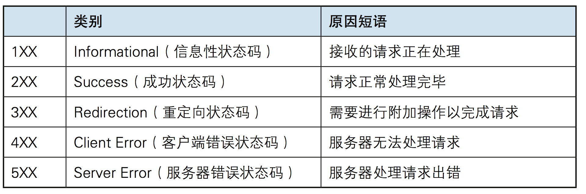

 

### **项目背景** 

    学习过程中实践练手的一个项目，主要参考了高性能服务器和Linux多线程服务器这两本书籍以及一些开源代码进行开发。主要涉及到的知识有C++、网络编程、多线程编程、Linux库函数。
 

### **简要描述** 

    项目由IO多路复用模块、定时器模块、线程池模块、缓冲区模块组成。实现了浏览器访问服务器，获取服务器资源的功能。项目总体的框架采用的是单Reactor多线程模型。在主线程里通过IO多路复用监听多个文件描述符上的事件。主线程负责连接的建立和断开，同时将读写和逻辑处理任务加入线程池里的任务队列，由线程池里的线程负责完成相应操作实现任务的并行处理。在应用层面实现心跳机制，通过定时器来清除不活跃的连接减少高并发场景下不必要的文件描述符的占用、维护一个TCP连接所需要的资源 。对于到达的HTTP报文，采用了有限状态机和正则表达式进行解析，资源的响应则通过集中写和内存映射的方式进行传输。最后加入日志模块实现服务器日常运行情况的记录。

### 项目职责
- 在应用层采用HTTP1.1协议构建B/S模型。通过使用状态机和正则表达式完成HTTP报文的解析。
- 通过构建线程池完成多个读写任务和逻辑处理任务的并行处理。
- 这里是列表文本同时采用Reactor设模式和IO多路复用实现了高并发的服务器。
- 这里是列表文本在应用层检测不活跃连接，通过及时释放资源来确保服务器在高并发场景下也能够稳定可靠。
### 项目优化（未实现）
- 这里是列表文本项目高并发的优化可以从线程池和网络设计模式这两部分入手。首先是单Reactor模型，可以采用Proactor模型或者多Reactor模型进行改进。Proactor模型对异步IO有要求，而在Linux上没有相关的异步IO系统调用，一般都是采用同步模拟（由主线程完成IO操作）去实现，相比之下强行模拟的效果不如采用单Reactor（这个时候主线程承担了太多工作）。另一个改良方案采用多Reactor模型，主线程只负责新连接到达的监听以及新连接的建立，对于新到达的连接通过生产者消费者模型分发给子Reactor（另起线程），由子Reactor完成已建立连接的读写事件监听任务。这样当有瞬间的高并发连接时，也不会出现新连接丢失的情况。
- 这里是列表文本另一个是关于线程池线程数量设定的优化。线程池的线程数量在构造的时候就已经确定下来，当机器核心数量改变时需要通过修改才能改变线程数量去匹配，不符合开闭原则，线程数量这一块可以通过C++17新特性动态获得机器的核心数量std::thread::hardware_concurrency()，来使程序更好的匹配机器实现更好的性能【避免核心数量过少进行频繁的上下文切换以及核心数量过多被闲置】。或者通过普通线程（临时创建用来响应多余的任务）和核心线程（一直存在）来优化【实现较为复杂】
### 个人收获
- 学习了基本的网络编程和多线程编程。进一步熟悉C++语法还有一些常用的新特性，了解常用的设计模式还有网络设计模式。了解一个项目框架和模块的设计方法。
### Linux上的五种IO模型
- 阻塞
调用者调用了某个函数，等待这个函数返回，期间什么也不做，不停的去检查这个函数有没有返回，必须等这个函数返回才能进行下一步动作。
- 非阻塞
非阻塞等待，每隔一段时间就去检测IO事件是否就绪。没有就绪就可以做其他事。非阻塞I/O执行系统调用总是立即返回，不管事件是否已经发生，若事件没有发生，则返回-1，此时可以根据 errno 区分这两种情况，对于accept，recv 和 send，事件未发生时，errno 通常被设置成 EAGAIN。
- IO复用
Linux 用 select/poll/epoll 函数实现 IO 复用模型，这些函数也会使进程阻塞，但是和阻塞IO所不同的是这些函数可以同时阻塞多个IO操作。而且可以同时对多个读操作、写操作的IO函数进行检测。直到有数据可读或可写时，才真正调用IO操作函数。
- 信号驱动
Linux 用套接口进行信号驱动 IO，安装一个信号处理函数，进程继续运行并不阻塞，当IO事件就绪，进程收到SIGIO 信号，然后处理 IO 事件。
- 异步
Linux中，可以调用 aio_read 函数告诉内核描述字缓冲区指针和缓冲区的大小、文件偏移及通知的方式，然后立即返回，当内核将数据拷贝到缓冲区后，再通知应用程序。
- HTTP状态码

### - 两种高效的事件处理模式

1. Reactor模式
要求主线程（I/O处理单元）只负责监听文件描述符上是否有事件发生，有的话就立即将该事件通知工作线程（逻辑单元），将 socket 可读可写事件放入请求队列，交给工作线程处理。除此之外，主线程不做任何其他实质性的工作。读写数据，接受新的连接，以及处理客户请求均在工作线程中完成。
1. Proactor模式
Proactor 模式将所有 I/O 操作都交给主线程和内核来处理（进行读、写），工作线程仅仅负责业务逻辑。
